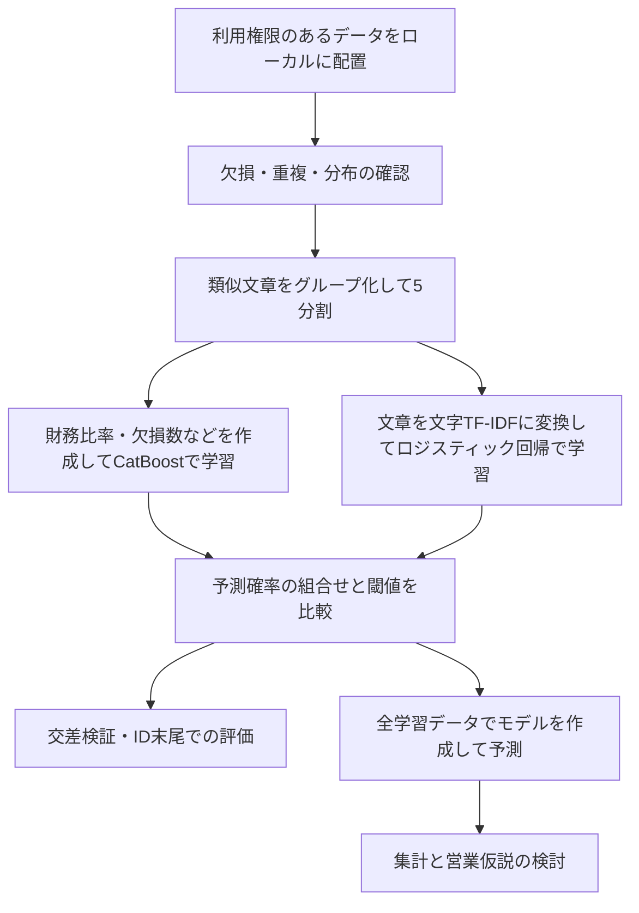

# DX教育商材の購入予測｜機械学習ポートフォリオ

企業の財務情報・アンケート・自由記述を使い、DX教育商材を購入するかを予測するPythonプロジェクトです。数値やカテゴリを扱うモデルと、文章を扱うモデルを組み合わせ、予測精度の検証から営業施策の仮説づくりまでを扱っています。

就職活動で取り組みを説明するため、既存の分析コードを整理しました。配布データ・課題PDF・実行済みノートブック・学習済みモデル・企業別の予測結果は含めていません。**大会固有の公開条件が未確認のため、現在は非公開で管理する前提の資料です。**

## 最初に見てほしいポイント

| 観点 | コードで行っていること | 意図 |
| --- | --- | --- |
| 異なる情報の活用 | CatBoostと文字TF-IDF＋ロジスティック回帰を組み合わせる | 財務・属性と文章の両方から購入傾向を捉える |
| 評価の工夫 | 類似文章を同じ検証グループにまとめる | よく似た企業情報が学習側と評価側に分かれる影響を抑える |
| 判断基準の調整 | 学習に使っていない行への予測でF1の閾値を比較する | 「購入する」と判定する確率を一律0.5に固定しない |
| 頑健性の確認 | 企業ID順の末尾20%を別途評価する | データの分布が変わったときの弱さを点検する |
| 分析から施策へ | 業界・企業規模・アンケート別に購入傾向を比較する | 営業対象や検証すべき施策の仮説を考える |

## 取り組んだ課題

目的は、限られた営業資源をどの企業に向けるかを検討するための購入予測です。目的変数は購入有無の二値で、中心となる評価指標はF1です。F1は「購入すると予測した企業のうち実際に購入した割合」と「購入企業をどれだけ見つけられたか」の両方を評価します。

これは分析・予測の実装例です。実際の売上増加や営業効率改善を実証したものではありません。

## 処理の流れ



1. 財務比率、金額の対数変換、欠損数、文章の長さやキーワード出現数を特徴量にします。
2. CatBoostで表形式の情報を学習します。企業IDと企業名そのものは基本モデルの入力から除外しますが、企業名の文字数などの派生特徴は含みます。
3. 文字の連続パターンをTF-IDFに変換し、ロジスティック回帰で文章から購入確率を求めます。
4. モデルの組合せと閾値を比較し、全件で再学習して予測を出力します。
5. 追加コードで文章列の組合せやセグメント特徴を比較し、購入傾向の集計を作成します。

## ファイル案内

| ファイル | 内容 | 実行の前提 |
| --- | --- | --- |
| [src/competition_pipeline.py](src/competition_pipeline.py) | 前処理、学習、検証、閾値探索、予測保存の本体 | 権限のある入力データ |
| [scripts/run_pipeline.py](scripts/run_pipeline.py) | 基本処理の実行入口 | 同上 |
| [scripts/run_phase1_text_experiments.py](scripts/run_phase1_text_experiments.py) | 文章列を単独・組合せで比較 | 学習データ |
| [scripts/analyze_survey_purchase.py](scripts/analyze_survey_purchase.py) | アンケートと購入の関連を集計・作図 | 学習データ、日本語フォント |
| [scripts/analyze_sales_insights.py](scripts/analyze_sales_insights.py) | 属性別の購入傾向と営業仮説を整理 | 基本処理の出力、日本語フォント |
| [scripts/run_segment_feature_experiments.py](scripts/run_segment_feature_experiments.py) | セグメント特徴の追加比較 | **当時の保存結果が必要。下記参照** |
| [docs/METHODOLOGY.md](docs/METHODOLOGY.md) | 検証設計、用語、限界 | 読み物 |
| [docs/DATA_POLICY.md](docs/DATA_POLICY.md) | データの扱いと掲載対象 | 読み物 |

## 実行方法

Python 3.12を想定しています。元環境の設定は3.12でした。新しい環境での実データを使った全工程の再実行は未実施です。

Windows PowerShellで、このリポジトリのフォルダから実行します。

```powershell
python -m venv .venv
.\.venv\Scripts\python.exe -m pip install -r requirements.txt
```

利用権限のある元のデータだけを、ローカルの `data/` に配置します。必要なファイルは `train.csv`、`test.csv`、`description.csv`、`sample_submit.csv` です。列定義は取得元の説明資料を参照してください。本リポジトリではデータを再配布しません。取得先の正確な課題URLは未確認です。

```powershell
# 学習・検証・予測の基本処理（複数モデルを学習するため時間がかかります）
.\.venv\Scripts\python.exe scripts/run_pipeline.py

# 任意：文章列の比較
.\.venv\Scripts\python.exe scripts/run_phase1_text_experiments.py

# 任意：アンケート分析、営業仮説の整理
.\.venv\Scripts\python.exe scripts/analyze_survey_purchase.py
.\.venv\Scripts\python.exe scripts/analyze_sales_insights.py
```

図の生成コードはWindowsの日本語フォントを参照します。他のOSではフォント指定の変更が必要です。データがない状態では学習は実行できません。

`output/` に評価・モデル・企業別予測、`submissions/` に提出形式のファイルが生成されます。これらはGitの対象外です。モデルには文章の語彙などが残り得るため、生成物をそのまま共有しないでください。

### 追加実験の再現性

セグメント比較は、過去の `catboost_depth6_class_weighted` というモデルと保存済みOOF予測を前提としています。現在の基本処理はその名前のモデルを生成しないため、基本処理の直後にこの追加実験を実行しても、前提チェックで停止します。過去の実験設計を読むために残しており、再現済みの実行例としては扱っていません。公開用整理では学習ロジックを変更していません。

## 成果として示す範囲

このリポジトリで確認できる成果は、特徴量作成、モデル比較、類似文章を考慮した評価、閾値調整、集計を一連のコードとして実装したことです。

データから算出した具体的なスコア・購入率・ランキングは掲載していません。現在のコードと当時の保存結果には前提の差があるため、過去の数値をこの版の再現結果として扱いません。大会順位・最終評価・事業効果も主張していません。

改善課題は、モデル選択まで含めた独立した最終評価、保存結果とコードの版管理、間接依存まで含めた実行環境の固定です。詳細は [検証設計と限界](docs/METHODOLOGY.md) に記載しています。

## 整理時の確認（2026年9月7日）

- 掲載対象12ファイルを確認し、Python 7ファイルが元コードと一致すること、構文と文書内の相対リンクを点検しました。
- 認証情報・個人のローカルパスの代表的なパターンと、元データの企業名・長い文章フィールドの転記を検査しました。
- データ、モデル、提出ファイル、PDF、ノートブックがGitの除外対象となることを確認しました。
- Python 3.12の別環境で、人工データ40行による特徴量作成、文章のグループ化、文章モデルの学習・予測、CatBoostの小規模な2分割検証、閾値選択を確認しました。直接依存はこの確認で使った版に固定しています。
- 実データでの全工程、追加実験の全実行、グラフの表示は未確認です。人工データの結果を予測性能の実績としては扱いません。

## 出典・制作範囲

SIGNATEの課題に取り組んだローカルプロジェクトを整理したもので、公式の教材・解答ではありません。元のチュートリアルや配布資料は掲載対象外です。

今回の整理ではCodexを使用して説明文と掲載対象の整理、機密情報の点検を行いました。既存コードは変更せず掲載しています。元の分析での本人・共同作業者・生成AIの担当範囲はコードだけでは判断できないため、「すべてを単独で作成した」とは記載していません。

一般的な手法・ライブラリの参照先： [CatBoost](https://catboost.ai/) / [scikit-learn](https://scikit-learn.org/stable/) / [pandas](https://pandas.pydata.org/)。元データや配布資料の権利を付与するものではなく、本整理で新しい再配布ライセンスは設定していません。
