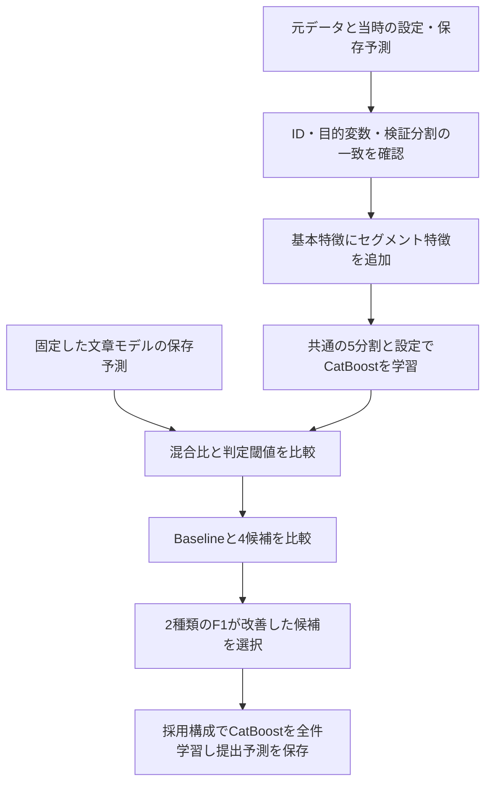

# DX教育商材の購入予測｜主解析 segment_v2

企業の財務情報・アンケート・自由記述から、DX教育商材の購入有無を予測するPythonプロジェクトです。**主解析は、企業の条件を組み合わせた特徴量を追加する `segment_v2_overlap` です。** 特徴量の候補を比較し、購入予測精度の改善を目指しました。

最初に読むコードは [scripts/run_segment_feature_experiments.py](scripts/run_segment_feature_experiments.py) です。利用者が主解析として指定した `submissions/segment_v2/` には、その提出結果 `submission_segment_v2.csv` が保存されています。ローカルの版対応表・実験記録・診断記録でも、v2が採用構成であることを確認しました。

就活用にコードと説明を整理しています。提出CSV、元データ、課題PDF、ノートブック、学習済みモデル、集計結果は掲載していません。大会固有の公開条件が未確認のため、リポジトリは非公開で管理しています。

## 何を工夫したか

| 工夫 | 実装 | 狙い |
| --- | --- | --- |
| 条件の組合せを特徴量にする | 基本セグメント3特徴に、条件の重なり4特徴を追加 | 単独の条件では捉えにくい購入傾向を表現する |
| 表形式と文章の情報を使う | CatBoostと文字TF-IDF＋ロジスティック回帰の予測を混合 | 財務・属性と自由記述を活用する |
| 比較条件をそろえる | 分割・CatBoost設定・文章の保存予測を共通化 | 候補間の差を比較しやすくする |
| 類似文章に配慮する | 似た文章の行を同じ検証グループにまとめる | 学習と評価に似た情報が分かれる影響を抑える |
| 判定閾値も検証する | 全OOFのF1と、閾値を他foldで選ぶF1を比較 | 閾値の調整だけに依存した改善を見分ける |

F1は「購入すると予測した企業のうち実際に購入した割合」と「購入企業をどれだけ見つけられたか」の両方を評価する指標です。主解析は予測精度の改善が目的で、営業効果を実証したものではありません。

## 主解析の流れ



共通の前処理では財務比率、対数変換、欠損数、文章の長さなどを作成します。企業ID・企業名そのものはモデル入力から除外しますが、企業名の文字数などの派生特徴は含みます。

v2では、DX課題、既存ツールへの満足度、BtoB属性、業界を条件にした7特徴を追加します。文章モデルは再学習せず、当時の保存済みOOF・評価用予測を全候補で共通使用します。詳細は [検証設計と特徴量](docs/METHODOLOGY.md) を参照してください。

| 比較対象 | 基本特徴に追加するもの | 位置づけ |
| --- | --- | --- |
| Baseline | なし | 比較基準 |
| segment_v1_basic | 基本セグメント3特徴 | 比較候補 |
| **segment_v2_overlap** | **基本3特徴＋重なり4特徴** | **主解析・当時の採用版** |
| segment_v3_survey | 基本3特徴＋アンケート交互作用3特徴 | 比較候補 |
| segment_v4_all | 全特徴 | 比較候補 |

## コード案内

| ファイル | 役割 |
| --- | --- |
| [scripts/run_segment_feature_experiments.py](scripts/run_segment_feature_experiments.py) | **主解析：特徴量比較、採用判断、提出予測の生成** |
| [src/competition_pipeline.py](src/competition_pipeline.py) | 主解析が再利用する前処理・分割・閾値関数、および基本処理 |
| [scripts/run_pipeline.py](scripts/run_pipeline.py) | 補足：現在の基本処理の実行入口 |
| [scripts/run_phase1_text_experiments.py](scripts/run_phase1_text_experiments.py) | 補足：文章列の単独・組合せ比較 |
| [scripts/analyze_survey_purchase.py](scripts/analyze_survey_purchase.py) | 補足：アンケートの集計・作図 |
| [scripts/analyze_sales_insights.py](scripts/analyze_sales_insights.py) | 補足：営業仮説の整理 |
| [docs/DATA_POLICY.md](docs/DATA_POLICY.md) | 非掲載データと共有方針 |

営業分析やID末尾のストレステストは補足の処理です。v2の主解析で営業効果やID末尾性能まで検証したとは扱いません。

## 実行方法と再現性

Python 3.12を想定しています。PowerShellでリポジトリのフォルダから環境を準備します。

```powershell
python -m venv .venv
.\.venv\Scripts\python.exe -m pip install -r requirements.txt
```

主解析には、利用権限のある `data/train.csv`、`data/test.csv`、`data/description.csv` と、以下の当時の保存ファイルが必要です。すべて非掲載です。列定義は取得元の資料を参照してください。正確な課題URLは未確認です。

- `output/model/model_config.json`
- `output/experiments/baseline/model_metrics.json`
- `output/experiments/baseline/cv_oof_predictions.csv`
- `output/experiments/baseline/test_probabilities.csv`

```powershell
# 当時の設定・保存予測がそろうローカル環境で実行
.\.venv\Scripts\python.exe scripts/run_segment_feature_experiments.py
```

**現在の基本処理を実行するだけでは、主解析の当時の前提は再現できません。** 主解析は過去の `catboost_depth6_class_weighted` の設定を前提としますが、現在の `run_pipeline.py` はその名前のモデルを生成しないため、その出力では前提チェックで停止します。新しいチェックアウトだけで当時の提出結果を再現できる状態ではありません。学習ロジックは元のコードのまま掲載しています。

主解析スクリプトはv2固定ではなく、Baselineと4候補を比較して採用候補を選びます。出力名は `submission_segment_v2.csv` に固定されています。別条件で再実行した場合は、名前だけでv2と判断せず、診断記録の `selected_experiment` を確認してください。

補足の `run_pipeline.py` には上記データに加えて `data/sample_submit.csv` が必要です。営業分析は基本処理の出力を参照し、作図コードはWindowsの日本語フォントを使用します。他OSではフォント指定の変更が必要です。

実行で作られる `output/` と `submissions/` はGitの対象外です。モデルに文章の語彙が残る可能性もあるため、生成物はそのまま共有しないでください。

## 成果として示す範囲

主解析で示す成果は、企業の条件の重なりを特徴量にし、共通条件で候補を比較して採用判断と提出予測につなげたことです。当時の記録でv2の採用を確認しましたが、今回は再学習していません。

データから算出した具体的なスコア・購入率・ランキングは掲載していません。大会順位・最終評価・事業効果も主張していません。同じOOFで特徴量構成と混合比を選んでいるため、独立評価や反復検証が今後の課題です。

## 整理時の確認（2026年9月7日）

- 掲載対象12ファイルを確認し、Python 7ファイルが元コードと一致すること、構文と文書内の相対リンクを点検しました。
- 認証情報・個人のローカルパスの代表的なパターンと、元データの企業名・長い文章フィールドの転記を検査しました。
- データ、モデル、提出ファイル、PDF、ノートブックがGitの除外対象となることを確認しました。
- Python 3.12の別環境で、人工データ40行による特徴量作成、文章のグループ化、文章モデルの学習・予測、CatBoostの小規模な2分割検証、閾値選択を確認しました。直接依存はこの確認で使った版に固定しています。
- 実データでの全工程、主解析の再実行、グラフの表示は未確認です。人工データの結果を予測性能の実績としては扱いません。

## 出典・制作範囲

SIGNATEの課題に取り組んだローカルプロジェクトを整理したもので、公式の教材・解答ではありません。元のチュートリアルや配布資料は掲載対象外です。

今回の整理ではCodexを使用して説明文と掲載対象の整理、機密情報の点検を行いました。既存コードは変更せず掲載しています。元の分析での本人・共同作業者・生成AIの担当範囲はコードだけでは判断できないため、「すべてを単独で作成した」とは記載していません。

一般的な手法・ライブラリの参照先： [CatBoost](https://catboost.ai/) / [scikit-learn](https://scikit-learn.org/stable/) / [pandas](https://pandas.pydata.org/)。元データや配布資料の権利を付与するものではなく、本整理で新しい再配布ライセンスは設定していません。
